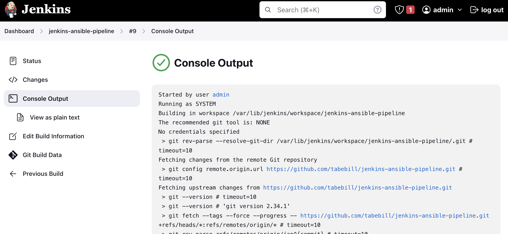
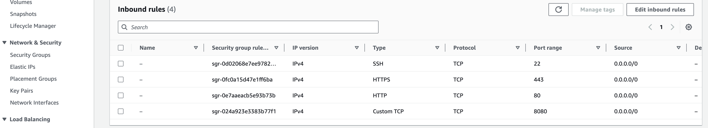
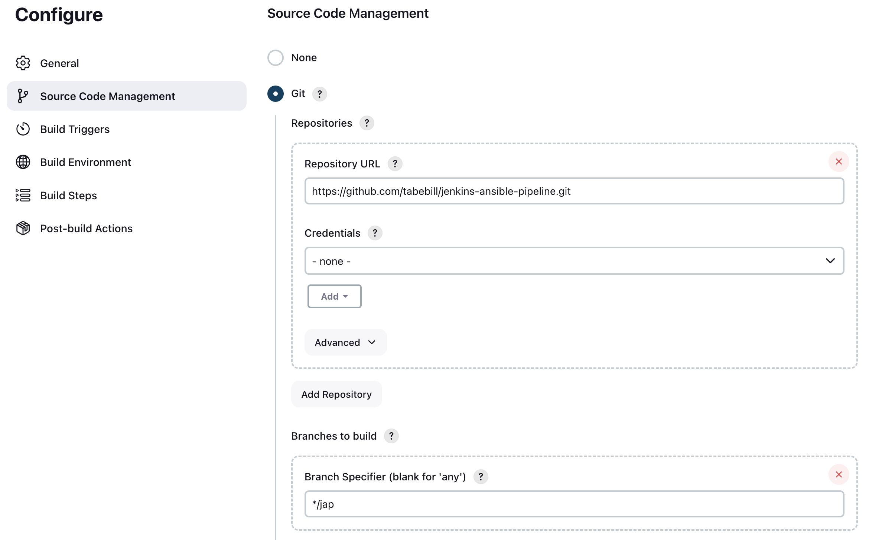
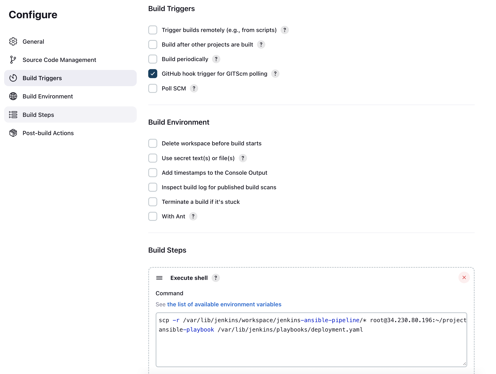
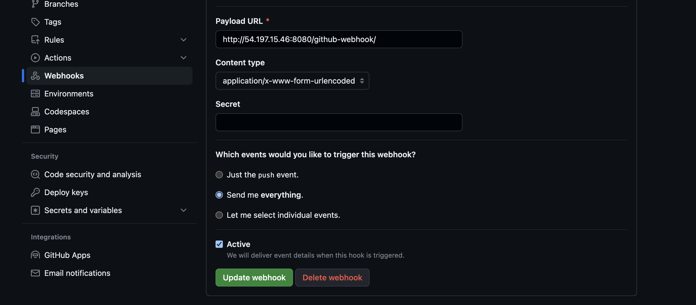
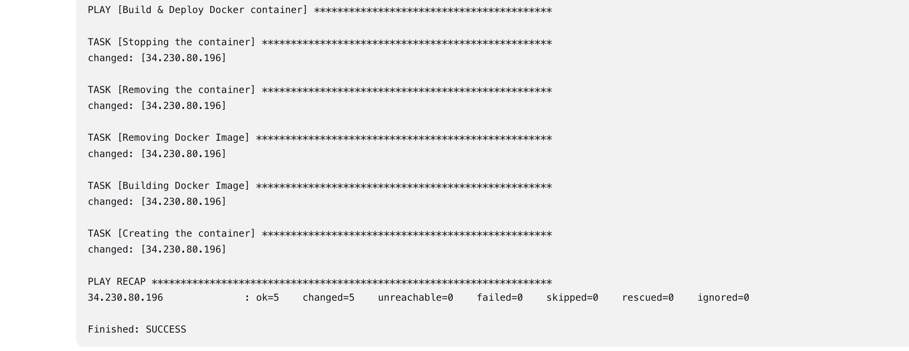

# Random Actor Generator Web App



## Table of Contents

- [About the Project](#about-the-project)
  - [Built With](#built-with)
- [Getting Started](#getting-started)
  - [Prerequisites](#prerequisites)
  - [Installation](#installation)
- [Usage](#usage)
- [Contributing](#contributing)
- [License](#license)

## About the Project

This project implements a CI/CD pipeline using Jenkins, GitHub, and AWS infrastructure. The process begins when code is pushed to the GitHub repository, triggering an automatic Jenkins build through a webhook. Jenkins, hosted on an AWS EC2 server, utilizes Ansible, also installed on the same server, to execute a playbook for building a Docker image. The necessary Ansible playbook resides on the Jenkins server. Upon successful image creation, the pipeline deploys the Docker image to another EC2 server, specifically provisioned for Docker hosting. This end-to-end automated pipeline ensures seamless integration, testing, and deployment of code changes, enhancing development agility and maintaining consistency across environments. Follow up with this documentation for detailed setup instructions and configuration details.

### Built With

- Jenkins
- Ansible
- Docker
- Github Webhooks
- Static Website

## Getting Started

To get a local copy of this project up and running, follow these simple steps.

### Prerequisites

- An AWS account
- A Github account to set up the webhook

### Installation

1. **Fork the Repository:** Click the "Fork" button at the top right of this repository's page. This creates your copy of the project, allowing you to make changes without affecting the original.

2. **Launch 2 EC2 instances:**
- Under AMI, select Ubuntu.
- For instance type select t2.medium.
- Opt to create a new keypair, give it a name of your choice, with a storage of 10 gb (gp3).
- Create a new security group, allowing SSH, HTTPS, & HTTP. Add a Custom TCP rule(for Jenkins) with a port range of 8080 and source 0.0.0.0/0.
- Launch the instances; name one, Jenkins and the other Docker.


3. **SSH into the Jenkins Server:**
- Change the hostname for easy identification as you will be SSH-ed into both servers simultaneously
```bash
sudo hostnamectl set-hostname Jenkins
/bin/bash
```
- Update the server
```bash
sudo apt update
```
- Install Jenkins Runtime Environemnt in the server. Enter `y` when prompted
```bash
sudo apt install openjdk-17-jre
```
- Install Jenkins. Enter `y` when prompted
```bash
sudo wget -O /usr/share/keyrings/jenkins-keyring.asc \
  https://pkg.jenkins.io/debian-stable/jenkins.io-2023.key
echo deb [signed-by=/usr/share/keyrings/jenkins-keyring.asc] \
  https://pkg.jenkins.io/debian-stable binary/ | sudo tee \
  /etc/apt/sources.list.d/jenkins.list > /dev/null
sudo apt-get update
sudo apt-get install jenkins
```
- Install Ansible with the below command:
```bash
sudo apt install ansible
```
- Copy the password outputted in the terminal and paste to continue with the Jenkins on the frontend. 
- Select the option to proceed to install suggested plugins.
- Install Docker(Enter `y` when prompted):
```bash
sudo apt install python3-pip
```
```bash
pip install docker
```
- Add the Docker server as a host:
```bash
cd /etc/ansible
sudo nano hosts
```
- In the opened file, add(IP-address - enter the IP address of the Docker server):
```
[dockerservers]
IP-address
```
- Switch to the root user and then to the Jenkins user to create a key to authenticate with the Docker server (Press enter trice inorder to save the key in root and not to create any passphrase - demo purposes):
```bash
sudo su
```
```bash
su jenkins
ssh-keygen
```
- Move to the .ssh directory to copy the public key to be pasted in the authorized keys file in the Docker server for authentication:
```bash
cd .ssh/
cat id_rsa.pub
```
- Copy the outputted content from 'ssh-rsa' to 'jenkins@jenkins'. (Refer to the 6th step in the section: "SSH into the Docker Server").
- Try connecting to the Docker server(replace `docker-server-ip` with the public ip of the docker server):
```bash
ssh root@docker-server-ip
```
- Connecting to the Docker server should be successful. Exit the the Docker server with the `exit` command. Go to the home directory, create a 'playbooks' directory and move into it:
```bash
cd ~
mkdir playbooks
cd playbooks
```
- Create a deployment.yaml file with the command:
```bash
nano deployment.yaml
```
- Paste into the file the contents of the deployment.yaml file found in this repository or the one you forked.
- Open Jenkins on the front-end, copy its public ip and paste in a new tab. Add a column and 8080 at the end. It should look like this: '_http://ip-address:8080_'
- To get the password, enter the below command in the Jenkins ssh terminal:
```bash
sudo cat /var/lib/jenkins/secrets/initialAdminPassword
```
- Select the option to install suggested plugins. For the next step, beneath select `Skip and continue as admin`. Select `Save and finish` in the section to set the url.
- When its loaded up, in the Jenkins dashboard, add new item. Name it `jenkins-ansible-pipeline`, then select freestyle project, and create.
- Scroll down to the section `Source Code Management`, add your forked repository and the name of the branch the code is stored in.

- Scroll down to the section `Build Triggers`, enable the option `GitHub hook trigger for GITScm Polling`. 
In the `Build Steps` section, select 'Execute Shell' in the dropdown and add the command(replace `jenkins-server-ip` with the public IP of the Jenkins server):
```bash
scp -r /var/lib/jenkins/workspace/jenkins-ansible-pipeline/* root@jenkins-server-ip:~/project/
ansible-playbook /var/lib/jenkins/playbooks/deployment.yaml
```


4. **SSH into the Docker Server:**
- Change the hostname
```bash
sudo hostnamectl set-hostname Docker
/bin/bash
```
- Install Docker with the following commands:
```bash
sudo apt-get update
sudo apt-get install ca-certificates curl gnupg
sudo install -m 0755 -d /etc/apt/keyrings
curl -fsSL https://download.docker.com/linux/ubuntu/gpg | sudo gpg --dearmor -o /etc/apt/keyrings/docker.gpg
sudo chmod a+r /etc/apt/keyrings/docker.gpg
```
```bash
echo \
  "deb [arch="$(dpkg --print-architecture)" signed-by=/etc/apt/keyrings/docker.gpg] https://download.docker.com/linux/ubuntu \
  "$(. /etc/os-release && echo "$VERSION_CODENAME")" stable" | \
  sudo tee /etc/apt/sources.list.d/docker.list > /dev/null
sudo apt-get update
```
```bash
sudo apt-get install docker-ce docker-ce-cli containerd.io docker-buildx-plugin docker-compose-plugin
```
- Once Docker is done installing, authenticate teh docker user with the daemon so its able to run docker commands. Use the below command:
```bash
sudo usermod -aG docker ubuntu
newgrp docker
```
- Switch to root user
```bash
sudo su
```
- Generate a key which the Jenkins server will use to authenticate with this Docker server: (Press enter trice inorder to save the key in root and not to create any passphrase - demo purposes).
```bash
ssh-keygen
```
- Move to the .ssh directory to paste the copied public key of the Jenkins server in the `authorized_keys` file. Refer to the 13th step in the section: "SSH into the Jenkins Server" (Comment out all the present text in the file).
```bash
cd .ssh/
nano authorized_keys
```

5. **Creating GitHub Webhook:**
- Login to your GitHub account, move to the repository you forked, and enter settings. On the left panel bar, enter `WebHooks` section and then `Add Webhook` button. It will ask for authentication and after doing that, enter the payload URL(jenkins-plublic-ip -- Public IP of the Jenkins server): `http://jenkins-public-ip:8080/github-webhook/`
- Select the option `Send me everthing`. Leave it on `Active`. The click the button `Update webhook`


## Usage

- Make changes to anything in the website files(change a sentence in the index.html). Commit the changes to your GitHub repository.
- Go to the Jenkins dashboard, click on the `jenkins-ansible-pipeline` item, and watch the build process being initiated(bottom left of the dashboard). 
- Once the build is completed it will show a green tick, click on it. Then scroll to the buttom, there you have the public IP address of the Docker server. Copy, and open it in a new tab.



## Contributing

Contributions are what make the open-source community such a fantastic place to learn, inspire, and create. Any contributions you make are greatly appreciated.

Fork the Project
Create your Feature Branch (git checkout -b feature/AmazingFeature)
Commit your Changes (git commit -m 'Add some AmazingFeature')
Push to the Branch (git push origin feature/AmazingFeature)
Open a Pull Request

## License

Distributed under the GNU License. See LICENSE for more information.